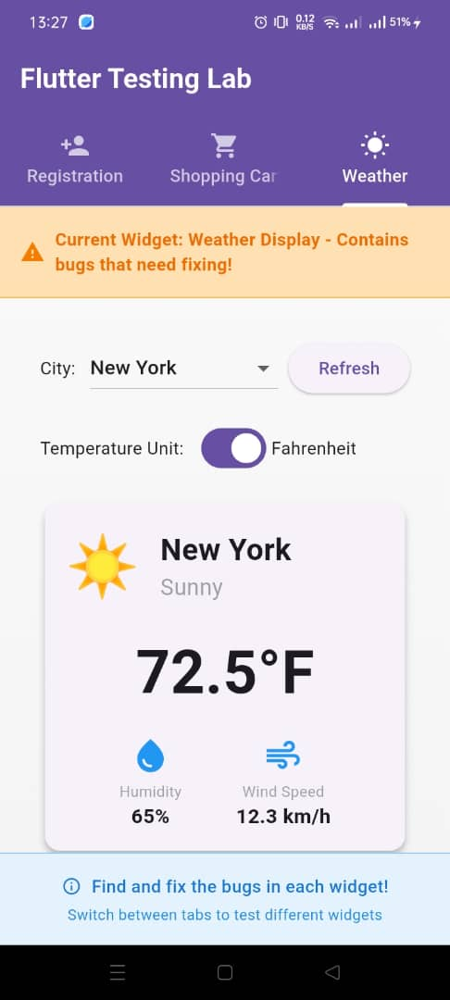
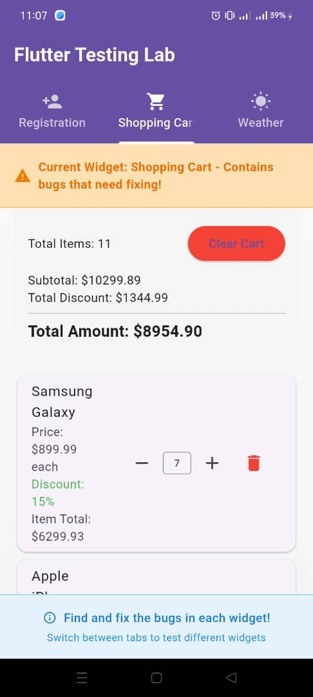

# Fixing the weather display issues
# Adding a unit test for it

  

# Fixing the cart issues
# Adding a unit test for the cart calculation logic

  

# Fixing the user registration form
# Adding a unit test for the validation logic

  

